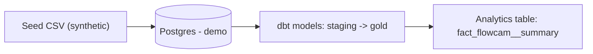
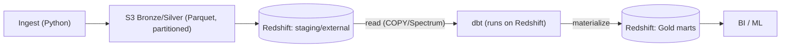

# BarAlgae — Public Demo (Data Infrastructure & Analytics)

[](https://github.com/AmitSass/algae-data-infrastructure/actions)
[](https://opensource.org/licenses/MIT)
[](https://www.python.org/downloads/release/python-3130/)
[](https://www.getdbt.com/)

**Purpose**: a screen-ready demo showing an end-to-end data workflow with synthetic data only.  
**Scope**: minimal, reproducible example (no production code, secrets, or proprietary logic).

## 30-Second Summary

Load synthetic FlowCAM-like measurements, model with dbt, and produce an analytics-ready fact table. The demo runs locally on Postgres (Docker).

**In production:** Python ingestors write partitioned Parquet to **S3** (Bronze/Silver), and **dbt on Redshift** builds **Gold marts** from S3 (COPY/Spectrum).

*More docs: [Project Overview](docs/OVERVIEW.md)*

## Architecture



## Quickstart

```bash
git clone https://github.com/AmitSass/algae-data-infrastructure && cd algae-data-infrastructure
cp .env.example .env
# .env is git-ignored; fill with demo values only
docker compose up -d          # starts Postgres for the demo
pip install -U dbt-postgres
export DBT_PROFILES_DIR=transform/dbt
# Windows (PowerShell): $env:DBT_PROFILES_DIR="transform/dbt"
dbt deps && dbt seed && dbt run && dbt test
```

**Optional**: The repo includes examples for Airflow / Great Expectations, but they're not required for this minimal run.

## What's Inside

- **`transform/dbt/`** — seeds + staging → gold models (fact_flowcam__summary) + schema tests
- **`docker-compose.yml`** — Postgres container
- **`.env.example`** — sample configuration (no real values)
- **`docs/diagrams/architecture.mmd`** — Mermaid diagram
- **(optional)** `orchestration/airflow/`, `data_quality/great_expectations/` examples

## Demo ↔ Prod Mapping

| Demo | Production (typical) |
|------|---------------------|
| Postgres (container) | Redshift / BigQuery / Snowflake |
| dbt seeds (CSV) | S3 "Silver" tables / CDC / APIs |
| staging → gold (minimal) | stg / int / marts (full medallion) |
| basic schema tests | richer tests + data-quality tooling |
| local .env (ignored) | secrets via env/vault/CI |

## Tech

Python · dbt · Postgres · Docker (examples reference Airflow & Great Expectations)

## Security & IP

Synthetic data only. No production endpoints, schemas, metrics, or secrets are included in this repository.

## Support

Questions? Open a [GitHub Issue](https://github.com/AmitSass/algae-data-infrastructure/issues)

Email (optional): hi@amitsass.dev

## Production Architecture



## License

MIT © Amit Sasson